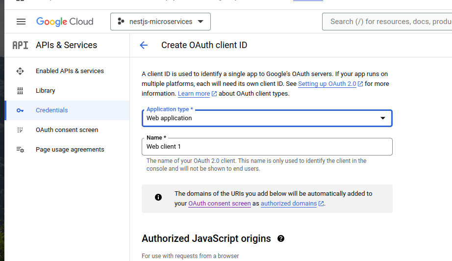
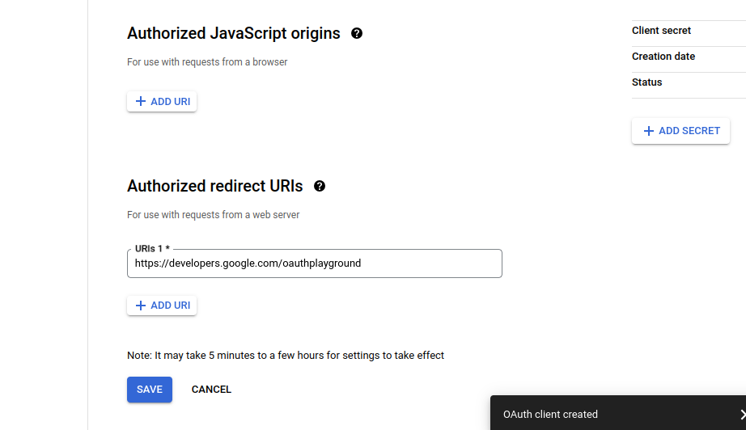

Install class validation and class transformer

```bash
npm i class-validator class-transformer
```

```ts
// in main.ts in @app/reservations
import { NestFactory } from '@nestjs/core';
import { ReservationsModule } from './reservations.module';
import { ValidationPipe } from '@nestjs/common';
import { Logger } from 'nestjs-pino';

async function bootstrap() {
  const app = await NestFactory.create(ReservationsModule);
  app.useGlobalPipes(new ValidationPipe());
  app.useLogger(app.get(Logger));
  await app.listen(3000);
}
bootstrap();
```

```bash
npm i nestjs-pino pino-http
```

```ts
// in reservations.module.ts on @app/reservations

import { Module } from '@nestjs/common';
import { ReservationsService } from './reservations.service';
import { ReservationsController } from './reservations.controller';
import { DatabaseModule } from '@app/common';
import { ReservationsRepository } from './reservations.repository';
import {
  ReservationDocument,
  ReservationSchema,
} from './models/reservation.schema';
import { LoggerModule } from 'nestjs-pino';

@Module({
  imports: [
    DatabaseModule,
    DatabaseModule.forFeature([
      { name: ReservationDocument.name, schema: ReservationSchema },
    ]),
    LoggerModule.forRoot(),
  ],
  controllers: [ReservationsController],
  providers: [ReservationsService, ReservationsRepository],
})
export class ReservationsModule {}
```

```bash
npm i pino-pretty
```

Update logger module on reservations.module.ts

```ts
LoggerModule.forRoot({
      pinoHttp: {
        transport: {
          target: 'pino-pretty',
          options: {
            singleLine: true,
          },
        },
      },
    }),
```



Generate logger on @app/common

```bash
nest g module logger
```



Refactor logger module

```ts
// in logger.module.ts on logger in @app/common
import { Module } from '@nestjs/common';
import { LoggerModule as PinoLoggerModule } from 'nestjs-pino';
@Module({
  imports: [
    PinoLoggerModule.forRoot({
      pinoHttp: {
        transport: {
          target: 'pino-pretty',
          options: {
            singleLine: true,
          },
        },
      },
    }),
  ],
})
export class LoggerModule {}
```

Create index.ts

```ts
// in index.ts on logger in @app/common
export * from './logger.module';
```

Update index.ts on @app/common

```ts
export * from './database/database.module';
export * from './config/config.module';
export * from './database/abstract.repository';
export * from './database/abstract.schema';
export * from './logger';
```

Update reservations.module.ts

```ts
import { Module } from '@nestjs/common';
import { ReservationsService } from './reservations.service';
import { ReservationsController } from './reservations.controller';
import { DatabaseModule, LoggerModule } from '@app/common';
import { ReservationsRepository } from './reservations.repository';
import {
  ReservationDocument,
  ReservationSchema,
} from './models/reservation.schema';

@Module({
  imports: [
    DatabaseModule,
    DatabaseModule.forFeature([
      { name: ReservationDocument.name, schema: ReservationSchema },
    ]),
    LoggerModule,
  ],
  controllers: [ReservationsController],
  providers: [ReservationsService, ReservationsRepository],
})
export class ReservationsModule {}
```

Update dto reservations

```ts
// in create-reservation.dto.ts
import { Type } from 'class-transformer';
import { IsDate, IsNotEmpty, IsString } from 'class-validator';

export class CreateReservationDto {
  @IsDate()
  @Type(() => Date)
  startDate: Date;

  @IsDate()
  @Type(() => Date)
  endDate: Date;

  @IsString()
  @IsNotEmpty()
  placeId: string;

  @IsString()
  @IsNotEmpty()
  invoiceId: string;
}
```

Update main.ts

```ts
import { NestFactory } from '@nestjs/core';
import { ReservationsModule } from './reservations.module';
import { ValidationPipe } from '@nestjs/common';
import { Logger } from 'nestjs-pino';

async function bootstrap() {
  const app = await NestFactory.create(ReservationsModule);
  app.useGlobalPipes(new ValidationPipe({ whitelist: true }));
  app.useLogger(app.get(Logger));
  await app.listen(3000);
}
bootstrap();
```
