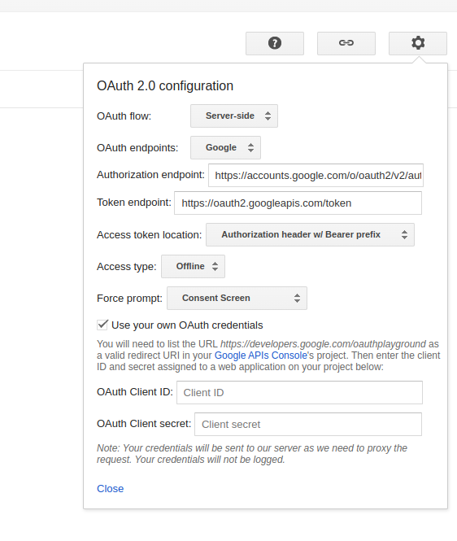
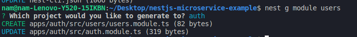

Generate app authenticate

```bash
nest g app auth
```



Generate module users


```bash
nest g module users
```

```bash
nest g controller users
```

```bash
nest g services users
```

Create folder dto and create file create-user.dto.ts

```ts
import { IsEmail, IsStrongPassword } from 'class-validator';

export class CreateUserDto {
  @IsEmail()
  email: string;

  @IsStrongPassword()
  password: string;
}
```
The same set up respository and models as reservations
1. create model
2. config repository
3. service
4. controller
5. add logger module
6. config dockerfile
7. update docker-compose