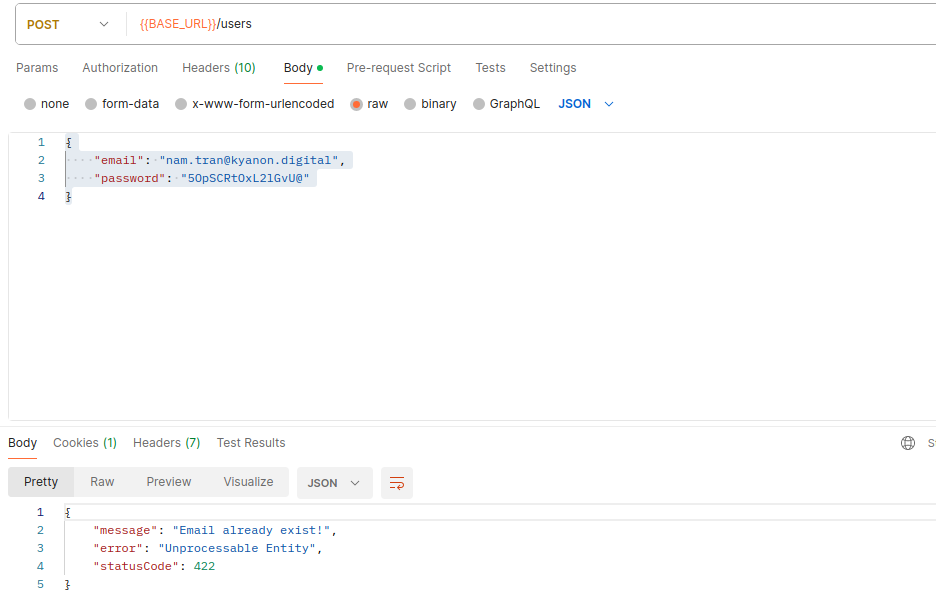

Install cookie-parser

```bash
npm i cookie-parser
```

```bash
npm i -D @types/cookie-parser
```

Create jwt.strategy.ts

```ts
// in jwt.strategy.ts
import { Injectable } from '@nestjs/common';
import { ConfigService } from '@nestjs/config';
import { PassportStrategy } from '@nestjs/passport';
import { Strategy } from 'passport-local';
import { UsersService } from '../users/users.service';
import { ExtractJwt } from 'passport-jwt';
import { Request } from 'express';
import { TokenPayload } from '../interfaces/token-payload.interface';

@Injectable()
export class JwtStrategy extends PassportStrategy(Strategy) {
  constructor(
    configureService: ConfigService,
    private readonly usersService: UsersService,
  ) {
    super({
      jwtFromRequest: ExtractJwt.fromExtractors([
        (request: Request) => request?.cookies?.Authentication,
      ]),
      secretOrKey: configureService.get('JWT_SECRET'),
    });
  }
  async validate({ userId }: TokenPayload) {
    return this.usersService.getUser({ _id: userId });
  }
}
```

Create jwt-auth.guard.ts on guards

```ts
// in jwt-auth.guard.ts
import { AuthGuard } from '@nestjs/passport';

export class JwtAuthGuard extends AuthGuard('jwt') {}
```

Create get-user.dto.ts on dto

```ts
// in get-user.dto.ts
import { IsNotEmpty, IsString } from 'class-validator';

export class GetUserDto {
  @IsString()
  @IsNotEmpty()
  _id: string;
}
```

Add users.controller.ts

```ts
// in users.controller.ts
import { Body, Controller, Get, Post, UseGuards } from '@nestjs/common';
import { CreateUserDto } from './dto/create-user.dto';
import { UsersService } from './users.service';
import { CurrentUser } from '../current-user.decorator';
import { UserDocument } from './models/users.schema';
import { JwtAuthGuard } from '../guards/jwt-auth.guard';

@Controller('users')
export class UsersController {
  constructor(private readonly usersService: UsersService) {}
  @Post()
  async createUser(@Body() createUser: CreateUserDto) {
    return this.usersService.register(createUser);
  }

  // new
  @Get()
  @UseGuards(JwtAuthGuard)
  async getUser(@CurrentUser() user: UserDocument) {
    return user;
  }
}
```

```ts
// in users.service.ts
import { Injectable, UnauthorizedException } from '@nestjs/common';
import * as bcrypt from 'bcryptjs';
import { CreateUserDto } from './dto/create-user.dto';
import { UsersRepository } from './users.repository';
import { GetUserDto } from './dto/get-user.dto';

@Injectable()
export class UsersService {
  constructor(private readonly usersRepository: UsersRepository) {}

  async register(createUser: CreateUserDto) {
    return this.usersRepository.create({
      ...createUser,
      password: await bcrypt.hash(createUser.password, 10),
    });
  }

  async verifyUser(email: string, password: string) {
    const user = await this.usersRepository.findOne({ email });
    const passwordIsValid = await bcrypt.compare(password, user.password);
    if (!passwordIsValid) {
      throw new UnauthorizedException('Credentials are not valid.');
    }
    return user;
  }
  // new
  async getUser(getUserDto: GetUserDto) {
    return this.usersRepository.findOne(getUserDto);
  }
}
```

```ts
// in auth.module.ts
import { Module } from '@nestjs/common';
import { AuthController } from './auth.controller';
import { AuthService } from './auth.service';
import { UsersModule } from './users/users.module';
import { LoggerModule } from '@app/common';
import { JwtModule } from '@nestjs/jwt';
import { ConfigService } from '@nestjs/config';
import { ConfigModule } from '@nestjs/config';
import * as Joi from 'joi';
import { LocalStrategy } from './strategies/local.strategy';
import { JwtStrategy } from './strategies/jwt.strategy';

@Module({
  imports: [
    UsersModule,
    LoggerModule,
    ConfigModule.forRoot({
      isGlobal: true,
      validationSchema: Joi.object({
        DATABASE_URI: Joi.string().required(),
        JWT_SECRET: Joi.string().required(),
        JWT_EXPIRATION: Joi.string().required(),
        PORT: Joi.number().required(),
      }),
    }),
    JwtModule.registerAsync({
      useFactory: (configService: ConfigService) => ({
        secret: configService.get<string>('JWT_SECRET'),
        signOptions: {
          expiresIn: `${configService.get('JWT_EXPIRATION')}s`,
        },
      }),
      inject: [ConfigService],
    }),
  ],
  controllers: [AuthController],
  providers: [AuthService, LocalStrategy, JwtStrategy], // new
})
export class AuthModule {}
```

```ts
// in auth.service.ts
import { Injectable } from '@nestjs/common';
import { UserDocument } from './users/models/users.schema';
import { ConfigService } from '@nestjs/config';
import { JwtService } from '@nestjs/jwt';
import { Response } from 'express';
import { TokenPayload } from './interfaces/token-payload.interface';

@Injectable()
export class AuthService {
  constructor(
    private readonly configService: ConfigService,
    private readonly jwtService: JwtService,
  ) {}
  async login(user: UserDocument, response: Response) {
    const tokenPayload: TokenPayload = {
      userId: user._id.toHexString(),
    };

    const expires = new Date();
    expires.setSeconds(
      expires.getSeconds() + this.configService.get('JWT_EXPIRATION'),
    );

    const token = this.jwtService.sign(tokenPayload);
    response.cookie('Authentication', token, {
      httpOnly: true,
      expires,
    });
  }
}
```

```ts
// in main.ts on auth
import { NestFactory } from '@nestjs/core';
import { AuthModule } from './auth.module';
import { ValidationPipe } from '@nestjs/common';
import { Logger } from 'nestjs-pino';
import { ConfigService } from '@nestjs/config';
import * as cookieParser from 'cookie-parser';

async function bootstrap() {
  const app = await NestFactory.create(AuthModule);
  app.use(cookieParser());
  app.useGlobalPipes(new ValidationPipe({ whitelist: true }));
  app.useLogger(app.get(Logger));
  const configService = app.get(ConfigService);
  await app.listen(configService.get('PORT'));
}
bootstrap();
```

Update validate exists email on register

```ts
// in users.service.ts
import {
  Injectable,
  UnauthorizedException,
  UnprocessableEntityException,
} from '@nestjs/common';
import * as bcrypt from 'bcryptjs';
import { CreateUserDto } from './dto/create-user.dto';
import { UsersRepository } from './users.repository';
import { GetUserDto } from './dto/get-user.dto';

@Injectable()
export class UsersService {
  constructor(private readonly usersRepository: UsersRepository) {}

  async register(createUser: CreateUserDto) {
    await this.validateCreateUserDto(createUser);
    return this.usersRepository.create({
      ...createUser,
      password: await bcrypt.hash(createUser.password, 10),
    });
  }
  // new
  private async validateCreateUserDto(createUser: CreateUserDto) {
    try {
      await this.usersRepository.findOne({ email: createUser.email });
    } catch (error) {
      return;
    }
    throw new UnprocessableEntityException('Email already exist!');
  }

  async verifyUser(email: string, password: string) {
    const user = await this.usersRepository.findOne({ email });
    const passwordIsValid = await bcrypt.compare(password, user.password);
    if (!passwordIsValid) {
      throw new UnauthorizedException('Credentials are not valid.');
    }
    return user;
  }

  async getUser(getUserDto: GetUserDto) {
    return this.usersRepository.findOne(getUserDto);
  }
}
```
