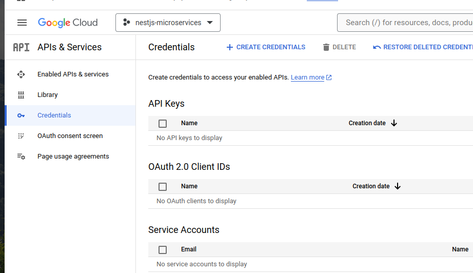
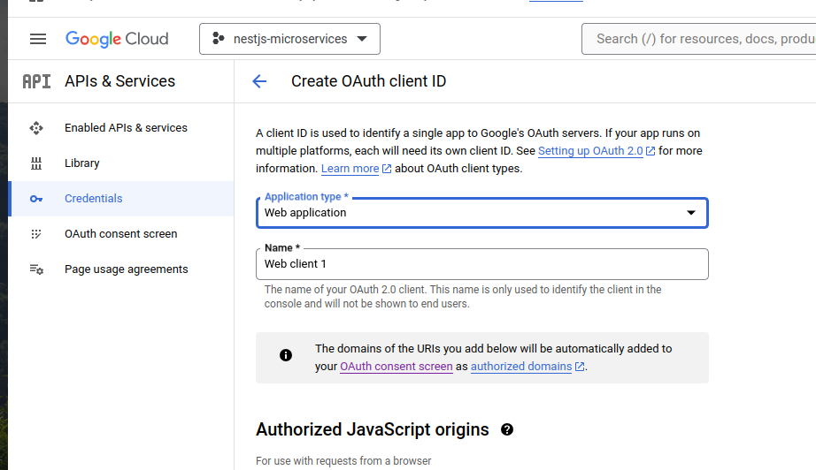
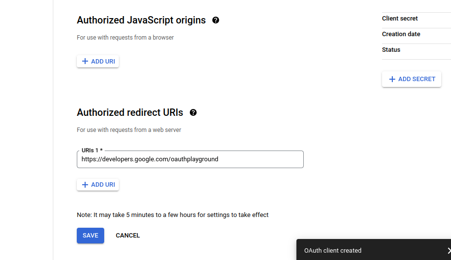
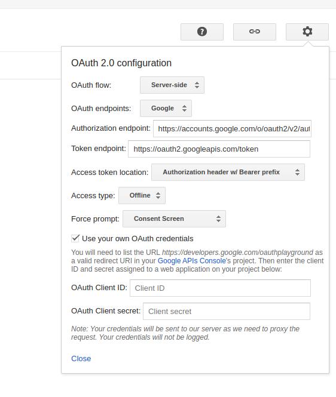
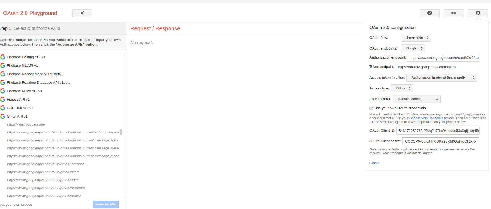
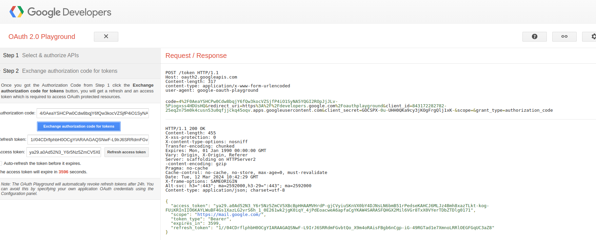

### Introduction:

In this tutorial, we will set up notifications when creating a new reservation

### Step 1: Create app a notification

Create a new notification app _apps/notifications_

```bash
nest g app notifications
```

Install dependencies

```bash
npm i nodemailer
```

```bash
npm i -D @types/nodemailer
```

In the "notifications" directory, create a new "Dockerfile"
to do this run the following command on your terminal:

```bash
touch apps/notifications/Dockerfile
```

and populate with the following content:

```
# Development Stage
FROM node:alpine as development

WORKDIR /usr/src/app

# Copy package.json and yarn.lock first to leverage Docker's build cache
COPY package.json yarn.lock ./

# Install dependencies
RUN npm install

# Copy application code
COPY . .

# Build the application
RUN npm run build

# Production Stage
FROM node:alpine as production

ARG NODE_ENV=production
ENV NODE_ENV=${NODE_ENV}

WORKDIR /usr/src/app

# Copy package.json and yarn.lock first to leverage Docker's build cache
COPY package.json yarn.lock ./

# Install dependencies
RUN npm install --prod

# Copy built application code from the development stage
COPY --from=development /usr/src/app/dist ./dist

# Specify the command to run the application
CMD ["node", "dist/apps/notifications/main"]
```

_Update Docker Compose:_
In your project's root directory, our existing `"docker-compose.yaml"` file let's define our auth service.

update your existing code with the following content:

```
services:
  reservations:
    build:
      context: .
      dockerfile: ./apps/reservations/Dockerfile
      target: development
    command: 'npm run start:dev reservations'
    env_file:
      - ./apps/reservations/.env
    ports:
      - '3000:3000'
    volumes:
      - .:/usr/src/app
  auth:
    build:
      context: .
      dockerfile: ./apps/auth/Dockerfile
      target: development
    command: 'npm run start:dev auth'
    env_file:
      - ./apps/auth/.env
    ports:
      - '3001:3001'
    volumes:
      - .:/usr/src/app
  payments:
    build:
      context: .
      dockerfile: apps/payments/Dockerfile
      target: development
    command: npm run start:dev payments
    env_file:
      - apps/payments/.env
    volumes:
      - .:/usr/src/app
  notifications:
    build:
      context: .
      dockerfile: apps/notifications/Dockerfile
      target: development
    command: npm run start:dev notifications
    env_file:
      - apps/notifications/.env
    volumes:
      - .:/usr/src/app
  mongo:
    image: mongo
```

In the file `.env` content:

```
PORT=3004
GOOGLE_OAUTH_CLIENT_ID=xxxx
GOOGLE_OAUTH_CLIENT_SECRET=xxxx
GOOGLE_OAUTH_REFRESH_TOKEN=myfresh
SMTP_USER=xxxxx@gmai.com
```

Update content `main.ts` in `notifications` app

```ts
import { NestFactory } from '@nestjs/core';
import { NotificationsModule } from './notifications.module';
import { ConfigService } from '@nestjs/config';
import { MicroserviceOptions, Transport } from '@nestjs/microservices';
import { Logger } from 'nestjs-pino';

async function bootstrap() {
  const app = await NestFactory.create(NotificationsModule);
  const configService = app.get(ConfigService);
  app.connectMicroservice<MicroserviceOptions>({
    transport: Transport.TCP,
    options: {
      host: '0.0.0.0',
      port: configService.get('PORT'),
    },
  });

  app.useLogger(app.get(Logger));

  await app.startAllMicroservices();
}
bootstrap();
```

Similar to the previous apps, we use `Config Service` in `notification.module.ts`

```ts
import { Module } from '@nestjs/common';
import { NotificationsController } from './notifications.controller';
import { NotificationsService } from './notifications.service';
import { LoggerModule } from '@app/common';
import { ConfigModule } from '@nestjs/config';
import * as Joi from 'joi';

@Module({
  imports: [
    LoggerModule,
    ConfigModule.forRoot({
      isGlobal: true,
      validationSchema: Joi.object({
        PORT: Joi.number().required(),
        GOOGLE_OAUTH_CLIENT_ID: Joi.string().required(),
        GOOGLE_OAUTH_CLIENT_SECRET: Joi.string().required(),
        GOOGLE_OAUTH_REFRESH_TOKEN: Joi.string().required(),
        SMTP_USER: Joi.string().required(),
      }),
    }),
  ],
  controllers: [NotificationsController],
  providers: [NotificationsService],
})
export class NotificationsModule {}
```

Create dto folder then create notify-email.dto.ts

```
mkdir apps/notification/src/dto
touch apps/notification/src/dto/notify-email.dto.ts
```

Description of `notify-email.dto.ts`

```ts
import { IsEmail, IsString } from 'class-validator';

export class NotifyEmailDto {
  @IsEmail()
  email: string;

  @IsString()
  text: string;
}
```

Description of `notifications.controller.ts`

```ts
import { Controller, Get, UsePipes, ValidationPipe } from '@nestjs/common';
import { NotificationsService } from './notifications.service';
import { EventPattern, Payload } from '@nestjs/microservices';
import { NotifyEmailDto } from './dto/notify-email.dto';

@Controller()
export class NotificationsController {
  constructor(private readonly notificationsService: NotificationsService) {}

  @UsePipes(new ValidationPipe())
  @EventPattern('notify-email')
  async notifyEmail(@Payload() data: NotifyEmailDto) {
    this.notificationsService.notifyEmail(data);
  }
}
```

Content in file `notifications.service.ts`

```ts
import { Injectable } from '@nestjs/common';
import { NotifyEmailDto } from './dto/notify-email.dto';
import * as nodemailer from 'nodemailer';
import { ConfigService } from '@nestjs/config';

@Injectable()
export class NotificationsService {
  constructor(private readonly configService: ConfigService) {}

  private readonly transporter = nodemailer.createTransport({
    service: 'gmail',
    auth: {
      type: 'OAuth2',
      user: this.configService.get('SMTP_USER'),
      clientId: this.configService.get('GOOGLE_OAUTH_CLIENT_ID'),
      clientSecret: this.configService.get('GOOGLE_OAUTH_CLIENT_SECRET'),
      refreshToken: this.configService.get('GOOGLE_OAUTH_REFRESH_TOKEN'),
    },
  });

  async notifyEmail({ email, text }: NotifyEmailDto) {
    await this.transporter.sendMail({
      from: this.configService.get('SMTP_USER'),
      to: email,
      subject: 'Microservices Notification',
      text: text,
    });
  }
}
```

Update _NOTIFICATIONS_SERVICE_ at `services.ts` in `libs/common/src/constants`

```ts
export const AUTH_SERVICE = 'auth';
export const PAYMENTS_SERVICE = 'payments';
export const NOTIFICATIONS_SERVICE = 'notification';
```

### _Update code in app payments_

Content in file `payments.controller.ts`

```ts
import { Controller, UsePipes, ValidationPipe } from '@nestjs/common';
import { PaymentsService } from './payments.service';
import { MessagePattern, Payload } from '@nestjs/microservices';
import { PaymentsCreateChargeDto } from './dto/payments-create-charge.dto';

@Controller()
export class PaymentsController {
  constructor(private readonly paymentsService: PaymentsService) {}

  @MessagePattern('create_charge')
  @UsePipes(new ValidationPipe())
  async createcharge(@Payload() data: PaymentsCreateChargeDto) {
    return this.paymentsService.createCharge(data);
  }
}
```

Content in file `payments.module.ts`

```ts
import { Module } from '@nestjs/common';
import { PaymentsController } from './payments.controller';
import { PaymentsService } from './payments.service';
import * as Joi from 'joi';
import { ConfigModule, ConfigService } from '@nestjs/config';
import { LoggerModule, NOTIFICATIONS_SERVICE } from '@app/common';
import { ClientsModule, Transport } from '@nestjs/microservices';

@Module({
  imports: [
    LoggerModule,
    ConfigModule.forRoot({
      isGlobal: true,
      validationSchema: Joi.object({
        PORT: Joi.number().required(),
        STRIPE_SECRET_KEY: Joi.string().required(), //we will set up this on step 4
        NOTIFICATIONS_HOST: Joi.string().required(),
        NOTIFICATIONS_PORT: Joi.number().required(),
      }),
    }),
    ClientsModule.registerAsync([
      {
        name: NOTIFICATIONS_SERVICE,
        useFactory: (configService: ConfigService) => ({
          transport: Transport.TCP,
          options: {
            host: configService.get('NOTIFICATIONS_HOST'),
            port: configService.get('NOTIFICATIONS_PORT'),
          },
        }),
        inject: [ConfigService],
      },
    ]),
  ],
  controllers: [PaymentsController],
  providers: [PaymentsService],
})
export class PaymentsModule {}
```

Content in file `payments.service.ts`

```ts
import { Inject, Injectable } from '@nestjs/common';
import { ConfigService } from '@nestjs/config';
import Stripe from 'stripe';
import { NOTIFICATIONS_SERVICE } from '@app/common';
import { ClientProxy } from '@nestjs/microservices';
import { PaymentsCreateChargeDto } from './dto/payments-create-charge.dto';

@Injectable()
export class PaymentsService {
  private readonly stripe = new Stripe(
    this.configService.get('STRIPE_SECRET_KEY'),
    {
      apiVersion: '2023-10-16',
    },
  );
  constructor(
    private readonly configService: ConfigService,
    @Inject(NOTIFICATIONS_SERVICE)
    private readonly notificationsService: ClientProxy,
  ) {}

  async createCharge({ amount, email }: PaymentsCreateChargeDto) {
    const paymentIntent = await this.stripe.paymentIntents.create({
      amount: amount * 100,
      automatic_payment_methods: {
        enabled: true,
        allow_redirects: 'never',
      },
      confirm: true,
      payment_method: 'pm_card_visa',
      currency: 'usd',
    });

    this.notificationsService.emit('notify-email', {
      email,
      text: `Your payments of ${amount} has completed successfully`,
    });

    return paymentIntent;
  }
}
```

Create `PaymentsCreateChargeDto` in `dto` folder extend CreateChargeDto. `*payments-create-charge.dto.ts*`

```ts
import { CreateChargeDto } from '@app/common';
import { IsEmail } from 'class-validator';

export class PaymentsCreateChargeDto extends CreateChargeDto {
  @IsEmail()
  email: string;
}
```

Update more variable in .env file

```
PORT=3003
STRIPE_SECRET_KEY=x
NOTIFICATIONS_HOST=notifications
NOTIFICATIONS_PORT=3004
```

### _Update code in app reservations_

`reservation.service.ts`

```ts
import { Inject, Injectable } from '@nestjs/common';
import { CreateReservationDto } from './dto/create-reservation.dto';
import { UpdateReservationDto } from './dto/update-reservation.dto';
import { ReservationsRepository } from './reservations.repository';
import { PAYMENTS_SERVICE, UserDto } from '@app/common';
import { ClientProxy } from '@nestjs/microservices';
import { map } from 'rxjs';

@Injectable()
export class ReservationsService {
  constructor(
    private readonly reservationRepository: ReservationsRepository,
    @Inject(PAYMENTS_SERVICE)
    private readonly payment_service: ClientProxy,
  ) {}

  async create(
    createReservationDto: CreateReservationDto,
    { email, _id: userId }: UserDto,
  ) {
    return this.payment_service
      .send('create_charge', {
        ...createReservationDto.charge,
        email,
      })
      .pipe(
        map(async (res) => {
          return this.reservationRepository.create({
            ...createReservationDto,
            timestamp: new Date(),
            invoiceId: res.id,
            userId,
          });
        }),
      );
  }

  async findAll() {
    return this.reservationRepository.find({});
  }

  async findOne(_id: string) {
    return this.reservationRepository.findOne({ _id });
  }

  async update(_id: string, updateReservationDto: UpdateReservationDto) {
    return this.reservationRepository.findOneAndUpdate(
      { _id },
      { $set: updateReservationDto },
    );
  }

  async remove(_id: string) {
    return this.reservationRepository.findOneAndDelete({ _id });
  }
}
```

`reservation.controller.ts`

```ts
import {
  Controller,
  Get,
  Post,
  Body,
  Patch,
  Param,
  Delete,
  UseGuards,
} from '@nestjs/common';
import { ReservationsService } from './reservations.service';
import { CreateReservationDto } from './dto/create-reservation.dto';
import { UpdateReservationDto } from './dto/update-reservation.dto';
import { CurrentUser, JwtAuthGuard, UserDto } from '@app/common';

@Controller('reservations')
export class ReservationsController {
  constructor(private readonly reservationsService: ReservationsService) {}

  @UseGuards(JwtAuthGuard)
  @Post()
  async create(
    @Body() createReservationDto: CreateReservationDto,
    @CurrentUser() user: UserDto,
  ) {
    return await this.reservationsService.create(createReservationDto, user);
  }

  @Get()
  @UseGuards(JwtAuthGuard)
  async findAll() {
    return this.reservationsService.findAll();
  }

  @Get(':id')
  @UseGuards(JwtAuthGuard)
  async findOne(@Param('id') id: string) {
    return this.reservationsService.findOne(id);
  }

  @Patch(':id')
  @UseGuards(JwtAuthGuard)
  async update(
    @Param('id') id: string,
    @Body() updateReservationDto: UpdateReservationDto,
  ) {
    return this.reservationsService.update(id, updateReservationDto);
  }

  @Delete(':id')
  @UseGuards(JwtAuthGuard)
  async remove(@Param('id') id: string) {
    return this.reservationsService.remove(id);
  }
}
```

### Set up OAUTH GOOGLE

1. https://console.cloud.google.com/
   Choose a API & Service then choose OAuth consent screen
   
   Choose Extenal
   
   Enter and contine
   
   Create a credentials
   
   
   
   Choose Refresh token
   [Oauth 2.0 playground](https://developers.google.com/oauthplayground/)
   
   
   
