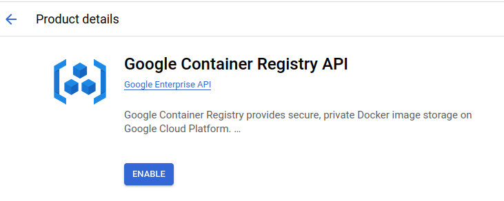

### Instroduction

Build deploy production step by step using Google Cloud

### Google Cloud Enginee Setup

#### Google Container Registry API

Enable Google container registry api

Enable Artifact Registry API

Create repository

Create a `reservations` repository

All repositories


#### Setup Instructions


Initialize gcloud
The [Google Cloud SDK](https://cloud.google.com/sdk/docs/?_gl=1*1lgs26w*_ga*MTU4NDAzMzg2Mi4xNzEwMjM5MTMx*_ga_WH2QY8WWF5*MTcxMDMwMTQ0Ni4zLjEuMTcxMDMwMTc1Ni4wLjAuMA..&_ga=2.233786206.-1584033862.1710239131&_gac=1.13958469.1710239131.Cj0KCQjw-r-vBhC-ARIsAGgUO2BjQFe2umR2IqD9rh4kppzH7xPImsfCR0u757aKFiN-1LNA8ihrpxkaAh8hEALw_wcB) is used to generate an access token when authenticating with Artifact Registry. Make sure that it is installed and initialized with [Application Default Credentials](https://cloud.google.com/sdk/gcloud/reference/auth/application-default/login?_gl=1*1lgs26w*_ga*MTU4NDAzMzg2Mi4xNzEwMjM5MTMx*_ga_WH2QY8WWF5*MTcxMDMwMTQ0Ni4zLjEuMTcxMDMwMTc1Ni4wLjAuMA..&_ga=2.233786206.-1584033862.1710239131&_gac=1.13958469.1710239131.Cj0KCQjw-r-vBhC-ARIsAGgUO2BjQFe2umR2IqD9rh4kppzH7xPImsfCR0u757aKFiN-1LNA8ihrpxkaAh8hEALw_wcB) before proceeding.

_Install the Google Cloud CLI_
[LINK](https://cloud.google.com/sdk/docs/install-sdk)

`Create config apps`

```bash
gcloud config configurations create nestjs-microservices
```

_Application Default Credentials_

```bash
gcloud auth application-default login
```

Choose `your account google` and allow google auth library
`Config` set `project id` on google cloud


```bash
gcloud config set project nestjs-417010
```

_Artifacts repositories list_

```bash
gcloud artifacts repositories list
```

*Configure Artifacts docker*


*Build* `reservations`
```bash
docker build  -t reservations -f Dockerfile ../../
```
Copy the repository id


```bash
docker tag reservations asia-southeast1-docker.pkg.dev/nestjs-417010/reservations/production
```
then push
```bash
docker image push asia-southeast1-docker.pkg.dev/nestjs-417010/reservations/production
```
Result

