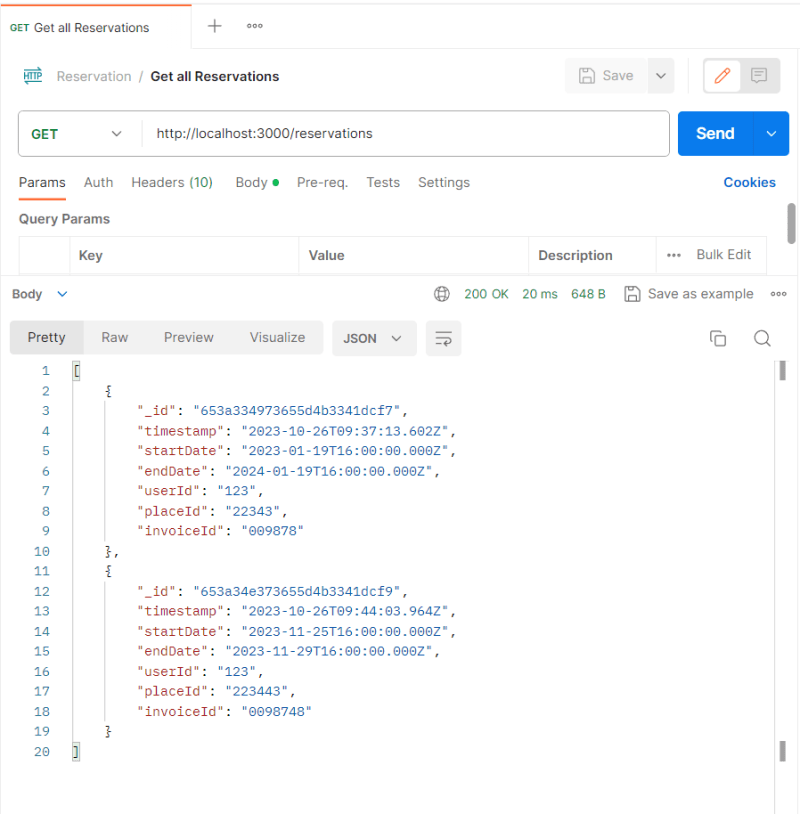
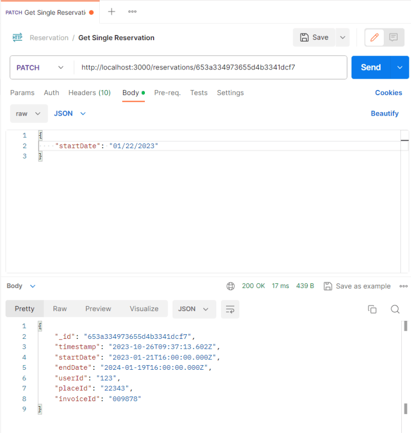
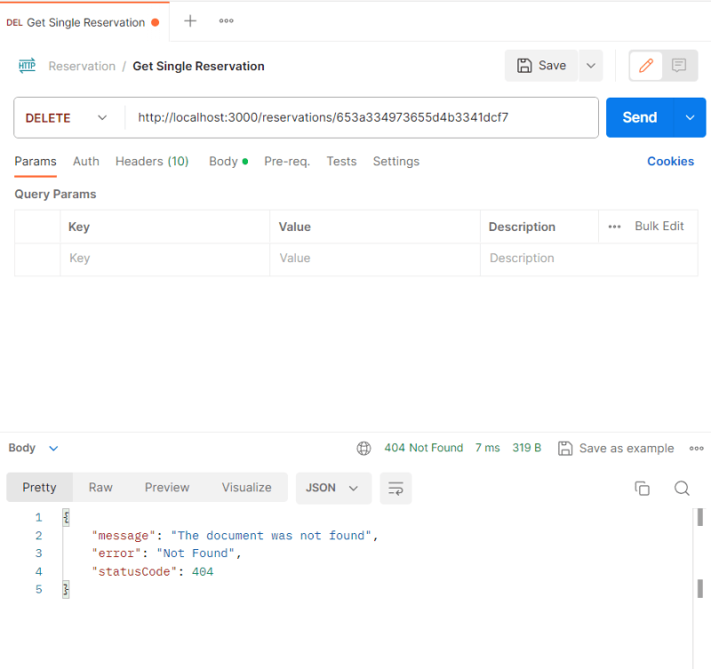

### Introduction
In this tutorial, we'll walk you through creating a microservice for handling reservations using Nest.js. We'll implement CRUD (*Create, Read, Update, Delete*) functionality for reservations and ensure data integrity through validation. We'll also make use of an abstract repository to simplify database operations.

### Prerequisites
Before getting started, make sure you have the following

#### Prerequisites:

- Basic knowledge of Nest.js
- MongoDB installed and running
- Postman (or any API testing tool)
### Part 1: Setting up the Microservice
#### 1.1 Creating the Microservice
First, let's create a new microservice named "reservations." In your terminal, run the following command:
```bash
nest g app reservations
```
This command generates the necessary project structure for your microservice.

you will now see a newly created folder named apps at the root of your directory

Open the apps directory, then delete the other created folders, leaving only the reservations folder, as it's the only folder we need for now.

your file structure inside apps directory should look like this
```
apps
  ├── reservations
  ├── tsconfig.app
  ├── test
  ├── src
     ├── reservations.controller.spec.ts
     ├── reservations.controller.ts
     ├── reservations.module.ts
     ├── reservations.service.ts
     └── main.ts
```
Since we are going to maximize the use of Nest CLI, we can remove the reservation controller, service, spec, and module for now. Just run the following command:
```bash
rm apps/reservations/src/reservations.controller.ts
rm apps/reservations/src/reservations.controller.spec.ts
rm apps/reservations/src/reservations.module.ts
rm apps/reservations/src/reservations.service.ts
```

#### 1.2 Updating the Nest CLI Configuration

Update the `nest-cli.json` file to configure your project correctly. Replace your existing code with the following code. We have removed unnecessary directories and updated some folder paths to point to our newly created reservations app.
```
{
  "$schema": "https://json.schemastore.org/nest-cli",
  "collection": "@nestjs/schematics",
  "sourceRoot": "apps/reservations/src",

  "projects": {
    "common": {
      "type": "library",
      "root": "libs/common",
      "entryFile": "index",
      "sourceRoot": "libs/common/src",
      "compilerOptions": {
        "tsConfigPath": "libs/common/tsconfig.lib.json"
      }
    },
    "reservations": {
      "type": "application",
      "root": "apps/reservations",
      "entryFile": "main",
      "sourceRoot": "apps/reservations/src",
      "compilerOptions": {
        "tsConfigPath": "apps/reservations/tsconfig.app.json"
      }
    }
  },
  "monorepo": true,
  "root": "apps/reservations"
}
```


#### 1.3 Generate a reservation resource

To generate a reservations resource using nest CLI just run the following command:
```bash
nest g resource reservations
```
it will prompt you with this
```
 Which project would you like to generate to? (Use arrow keys)
> reservations [ Default ]
```
just hit enter
```
What transport layer do you use? (Use arrow keys)
> REST API 
  GraphQL (code first)
  GraphQL (schema first)
  Microservice (non-HTTP)
  WebSockets
```
choose REST API then hit enter
```
Would you like to generate CRUD entry points? (Y/n) 
```
type y then hit enter it will generate a reservation resource with CRUD functionality

open your `apps/reservations/src/main.ts` and update your code with the following code:
```ts
import { NestFactory } from '@nestjs/core';
import { ReservationsModule } from './reservations/reservations.module';

async function bootstrap() {
  const app = await NestFactory.create(ReservationsModule);
  await app.listen(3000);
}
bootstrap();
```
What we did is simply update the imports, as we are using the generated reservation module

#### 1.4 Adding Database Module

In your "*reservations*" microservice, you'll need to set up the database connection. We assume you already have a "common" module with a database configuration (we set up this in the previous lessons).
In your "*reservations*" module (`apps/reservations/src/reservations.module.ts`), import the database module as shown:
```ts
import { Module } from '@nestjs/common';
import { ReservationsController } from './reservations.controller';
import { ReservationsService } from './reservations.service';
import { DatabaseModule } from '@app/common';

@Module({
  imports: [DatabaseModule],
  controllers: [ReservationsController],
  providers: [ReservationsService],
})
export class ReservationsModule {}
```
if you run npm run start:dev your application should be perfectly fine

### Part 2: Building the Reservation Schema
#### 3.1 Creating a Reservation Schema

open your `apps/src/reservations/entities/reservations.entity.ts`
and populate with the following code:
```ts
import { AbstractDocument } from '@app/common';
import { Prop, Schema, SchemaFactory } from '@nestjs/mongoose';

@Schema({ versionKey: false })
export class ReservationDocument extends AbstractDocument {
  @Prop({ type: Date, default: Date.now })
  timestamp: Date;

  @Prop({ type: Date, required: true })
  startDate: Date;

  @Prop({ type: Date, required: true })
  endDate: Date;

  @Prop({ type: String, required: true })
  userId: string;

  @Prop({ type: String, required: true })
  placeId: string;

  @Prop({ type: String, required: true })
  invoiceId: string;
}

export const ReservationSchema =
  SchemaFactory.createForClass(ReservationDocument);
```
*Code Explanation:*

##### Import Statements:
AbstractDocument is imported from the '*@app/common*' module, and it is a custom base class for Mongoose documents.
The various decorators and classes from '*@nestjs/mongoose*' are imported for schema definition.

##### ReservationDocument Class:
ReservationDocument is a class representing a Mongoose document. It extends the AbstractDocumentclass, which contains common fields and methods for documents.

The *@Schema decorator* is used to define the schema for this document. { versionKey: false } is passed as an option to the schema decorator to disable the version key that Mongoose adds by default.

The class defines several properties using the @*Prop decorator*, each representing a field in the document.
ReservationSchema Constant:

*ReservationSchema* is created using `SchemaFactory.createForClass(ReservationDocument)`. This function generates a Mongoose schema based on the ReservationDocument class. The resulting schema can be used to interact with the database using Mongoose.

### Part 3: Implementing CRUD Functionality
#### 2.1 Extending the Abstract Repository

In your "*reservations*" microservice, create a custom repository that extends the AbstractRepository. Make sure to import the necessary dependencies and configure your custom repository.

Create a `reservation.repository.ts` file to do this run the following command:
```bash
touch apps/reservations/src/reservations/reservations.repository.ts
```
populate it with this code:
```ts
import { Model } from 'mongoose';
import { InjectModel } from '@nestjs/mongoose';
import { Injectable, Logger } from '@nestjs/common';
import { AbstractRepository } from '@app/common';
import { ReservationDocument } from './entities/reservation.entity';

@Injectable()
export class ReservationsRepository extends AbstractRepository<ReservationDocument> {
  protected readonly logger = new Logger(ReservationsRepository.name);
  constructor(
    @InjectModel(ReservationDocument.name)
    protected readonly reservationModel: Model<ReservationDocument>,
  ) {
    super(reservationModel);
  }
}
```
*Code Explanation*
Import Statements:

*Model* is imported from the 'mongoose' module. It represents a Mongoose model for database operations.

*InjectModel* is imported from '@nestjs/mongoose' and is used for injecting the Mongoose model into the repository.

*Injectable* and *Logger* are imported from '`@nestjs/common`'. `Injectable` is used to mark the class as a Nest.js service, and Logger provides a logging mechanism.

*AbstractRepository* is imported from '@app/common', and it's a custom base class for repositories that we created.

*ReservationDocument* is imported from the local file `'./entities/reservation.entity'.` It represents the Mongoose document for reservations.

`*ReservationsRepository Class:*`

*ReservationsRepository* is a Nest.js service class and is marked as @Injectable() to be used as a dependency.

It extends `AbstractRepository<ReservationDocument>`, which inherits common repository methods from the AbstractRepository class.
This is a common practice to avoid code duplication.
The logger property is created with a logger instance, which can be used for logging purposes.

In the constructor, the *@InjectModel(ReservationDocument.name)* decorator is used to inject the Mongoose model for the ReservationDocument. The model is stored in the reservationModel property.

The *super(reservationModel)* call invokes the constructor of the base class, AbstractRepository, and passes the Mongoose model for reservations.

Now finally, we can go back to our *reservations module*, and for our providers array, we're going to pass in the newly created reservations repository.

So we can actually inject it into our application. to do this just open your apps/reservations/src/reservation.module.ts and update your code with the following content:
```ts
import { Module } from '@nestjs/common';
import { ReservationsService } from './reservations.service';
import { ReservationsController } from './reservations.controller';
import { DatabaseModule } from '@app/common';
import { ReservationsRepository } from './reservations.repository';
import {
  ReservationDocument,
  ReservationSchema,
} from './entities/reservation.entity';

@Module({
  imports: [
    DatabaseModule,
    DatabaseModule.forFeature([
      { name: ReservationDocument.name, schema: ReservationSchema },
    ]),
  ],
  controllers: [ReservationsController],
  providers: [ReservationsService, ReservationsRepository],
})
export class ReservationsModule {}
```
if you run 
```bash 
npm run start:dev 
```
your application should run successfully

### Part 4: Setu Data Transfer Object (dto)
#### 5.1 Create DTOs
Define Data Transfer Objects (DTOs) for both creating and updating reservations.

open your reservation dto (`apps/reservations/src/dto/create-reservation.dto.ts`) and populate with the following code:
```ts
export class CreateReservationDto {
  startDate: Date;
  endDate: Date;
  placeId: string;
  invoiceId: string;
}
```
### Part 5: Using the Reservation Repository
Now, let's use the reservation repository within your microservice. In your "*reservations*" service, inject the *ReservationsRepository* and implement CRUD functionality using the repository methods. Be sure to import the required dependencies and provide proper error handling and validation.

Here's how you can use the `ReservationsRepository` to implement CRUD functionality in your `apps/reservations/src/reservations.service.ts`:
```ts
import { Injectable } from '@nestjs/common';

import { ReservationsRepository } from './reservations.repository';
import { CreateReservationDto } from './dto/create-reservation.dto';
import { UpdateReservationDto } from './dto/update-reservation.dto';

@Injectable()
export class ReservationsService {
  constructor(
    private readonly reservationsRepository: ReservationsRepository,
  ) {}

  async createReservation(createReservationDto: CreateReservationDto) {
    return this.reservationsRepository.create({
      ...createReservationDto,
      timestamp: new Date(),
      userId: '123', // for now just hard-code it
    });
  }

  async findAll() {
    return this.reservationsRepository.find({});
  }

  async findOne(_id: string) {
    return this.reservationsRepository.findOne({ _id });
  }

  async update(_id: string, updateReservationDto: UpdateReservationDto) {
    return this.reservationsRepository.findOneAndUpdate(
      { _id },
      { $set: updateReservationDto },
    );
  }

  async remove(_id: string) {
    return this.reservationsRepository.findOneAndDelete({ _id });
  }
}
```
*Update reservation controller*
open your `apps/reservations/src/reservations.controller.ts` and populate with the following code
```ts
import {
  Controller,
  Get,
  Post,
  Body,
  Patch,
  Param,
  Delete,
} from '@nestjs/common';
import { ReservationsService } from './reservations.service';
import { CreateReservationDto } from './dto/create-reservation.dto';
import { UpdateReservationDto } from './dto/update-reservation.dto';

@Controller('reservations')
export class ReservationsController {
  constructor(private readonly reservationsService: ReservationsService) {}

  @Post()
  create(@Body() createReservationDto: CreateReservationDto) {
    return this.reservationsService.create(createReservationDto);
  }

  @Get()
  findAll() {
    return this.reservationsService.findAll();
  }

  @Get(':id')
  findOne(@Param('id') id: string) {
    return this.reservationsService.findOne(id);
  }

  @Patch(':id')
  update(
    @Param('id') id: string,
    @Body() updateReservationDto: UpdateReservationDto,
  ) {
    return this.reservationsService.update(id, updateReservationDto);
  }

  @Delete(':id')
  remove(@Param('id') id: string) {
    return this.reservationsService.remove(id);
  }
}
```
    what we did is that we just got rid of the + sign prefix to id(+id)

### Part 6: Test Our Application (I'm using Postman)
Before we dive into validation, let's take a moment to test the functionality of our newly created API. We're using Postman to interact with the API endpoints. If you haven't used Postman before, it's a handy tool for testing APIs and checking response

#### 6.1 Creating a Reservation:
We begin by testing the POST request to create a reservation. We provide a JSON request body with properties such as the `startDate, endDate, placeId, and invoiceId.`

When we execute this request, we receive a successful response with a status code of `201`, indicating that the reservation was created. The response also contains the newly created reservation data.

#### 6.2 Fetching All Reservations:
Next, we test the GET request to retrieve all reservations using the "find all" route. The response includes an array of reservations



#### 6.3 Finding a Single Reservation:
To retrieve a specific reservation, we use the GET request, and we provide the ID as part of the route. We extract the ID using the params decorator. The response contains the single reservation corresponding to the provided ID.


#### 6.4 Updating a Reservation:
We test the Put request to update a reservation. In this example, we changed the start date of the reservation from the 20th to the 22nd. When we send this request, the response indicates that the start date has been successfully updated.



#### 6.5Deleting a Reservation:
To delete a reservation, we use the DELETE request and provide the ID as a parameter. The response confirms the successful deletion of the reservation. However, when we attempt to fetch the same reservation using a GET request, we encounter a 404 error, as expected, since the reservation no longer exists.



### Conclusion
Congratulations! You've created a Nest.js microservice for reservations and implemented CRUD functionality using an abstract repository. You now have a robust system to handle reservations in your application.