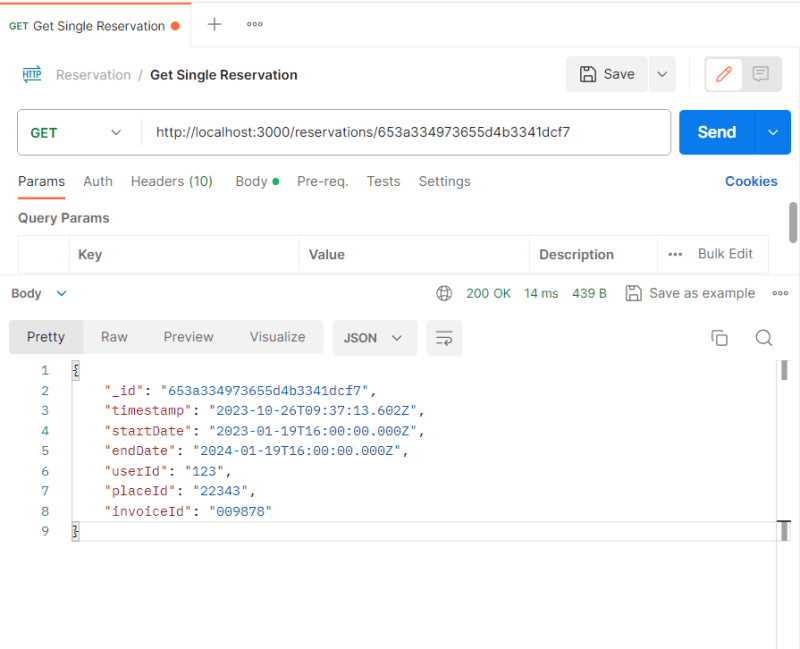
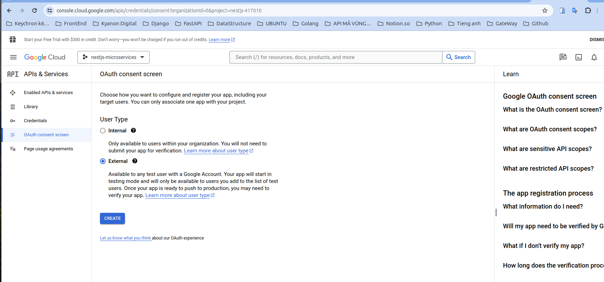

Generate app reservations

```bash
nest g app reservations
```


Generate Resource reservations on app reservations

```bash
nest g resource reservations
```


Copy all reservation to move on parent app reservation src

Update index.ts on @app/common

```ts
export * from './database/database.module';
export * from './config/config.module';
export * from './database/abstract.repository';
export * from './database/abstract.schema';
```

Rename enities to models and reservation.schema.ts and content reservation.schema.ts

```ts
// In reservation.schema.ts
import { AbstractDocument } from '@app/common';
import { Prop, Schema, SchemaFactory } from '@nestjs/mongoose';

@Schema({ versionKey: false })
export class ReservationDocument extends AbstractDocument {
  @Prop()
  timestamp: Date;

  @Prop()
  startDate: Date;

  @Prop()
  endDate: Date;

  @Prop()
  userId: string;

  @Prop()
  placeId: string;

  @Prop()
  invoiceId: string;
}

export const ReservationSchema =
  SchemaFactory.createForClass(ReservationDocument);
```

Update database.module.ts

```ts
// In database.module.ts on @app/common
import { Module } from '@nestjs/common';
import { ConfigService } from '@nestjs/config';
import { ModelDefinition, MongooseModule } from '@nestjs/mongoose';
import { ConfigModule } from '../config/config.module';

@Module({
  imports: [
    MongooseModule.forRootAsync({
      imports: [ConfigModule],
      useFactory: async (configService: ConfigService) => ({
        uri: configService.get('DATABASE_URI'),
      }),
      inject: [ConfigService],
    }),
  ],
})
export class DatabaseModule {
  static forFeature(models: ModelDefinition[]) {
    return MongooseModule.forFeature(models);
  }
}
```

Add repository for reservation

```ts
// reservations.repository.ts
import { AbstractRepository } from '@app/common';
import { Injectable, Logger } from '@nestjs/common';
import { ReservationDocument } from './models/reservation.schema';
import { InjectModel } from '@nestjs/mongoose';
import { Model } from 'mongoose';

@Injectable()
export class ReservationsRepository extends AbstractRepository<ReservationDocument> {
  protected readonly logger = new Logger(ReservationsRepository.name);

  constructor(
    @InjectModel(ReservationDocument.name)
    reservationModel: Model<ReservationDocument>,
  ) {
    super(reservationModel);
  }
}
```

Update reservation.module.ts

```ts
// In reservation.module.ts
import { Module } from '@nestjs/common';
import { ReservationsService } from './reservations.service';
import { ReservationsController } from './reservations.controller';
import { DatabaseModule } from '@app/common';
import { ReservationsRepository } from './reservations.repository';
import {
  ReservationDocument,
  ReservationSchema,
} from './models/reservation.schema';

@Module({
  imports: [
    DatabaseModule,
    DatabaseModule.forFeature([
      { name: ReservationDocument.name, schema: ReservationSchema },
    ]),
  ],
  controllers: [ReservationsController],
  providers: [ReservationsService, ReservationsRepository],
})
export class ReservationsModule {}
```

Update dto create-reservation.dto.ts

```ts
// create-reservation.dto.ts
export class CreateReservationDto {
  startDate: Date;

  endDate: Date;

  placeId: string;

  invoiceId: string;
}
```

Update reservations.service.ts

```ts
import { Injectable } from '@nestjs/common';
import { CreateReservationDto } from './dto/create-reservation.dto';
import { UpdateReservationDto } from './dto/update-reservation.dto';
import { ReservationsRepository } from './reservations.repository';

@Injectable()
export class ReservationsService {
  constructor(private readonly reservationRepository: ReservationsRepository) {}

  create(createReservationDto: CreateReservationDto) {
    return this.reservationRepository.create({
      ...createReservationDto,
      timestamp: new Date(),
      userId: '12312',
    });
  }

  findAll() {
    return this.reservationRepository.find({});
  }

  findOne(_id: string) {
    return this.reservationRepository.findOne({ _id });
  }

  update(_id: string, updateReservationDto: UpdateReservationDto) {
    return this.reservationRepository.findOneAndUpdate(
      { _id },
      { $set: updateReservationDto },
    );
  }

  remove(_id: string) {
    return this.reservationRepository.findOneAndDelete({ _id });
  }
}
```

Update reservations.controller.ts

```ts
// In reservations.controller.ts
import {
  Controller,
  Get,
  Post,
  Body,
  Patch,
  Param,
  Delete,
} from '@nestjs/common';
import { ReservationsService } from './reservations.service';
import { CreateReservationDto } from './dto/create-reservation.dto';
import { UpdateReservationDto } from './dto/update-reservation.dto';

@Controller('reservations')
export class ReservationsController {
  constructor(private readonly reservationsService: ReservationsService) {}

  @Post()
  create(@Body() createReservationDto: CreateReservationDto) {
    return this.reservationsService.create(createReservationDto);
  }

  @Get()
  findAll() {
    return this.reservationsService.findAll();
  }

  @Get(':id')
  findOne(@Param('id') id: string) {
    return this.reservationsService.findOne(id);
  }

  @Patch(':id')
  update(
    @Param('id') id: string,
    @Body() updateReservationDto: UpdateReservationDto,
  ) {
    return this.reservationsService.update(id, updateReservationDto);
  }

  @Delete(':id')
  remove(@Param('id') id: string) {
    return this.reservationsService.remove(id);
  }
}
```





